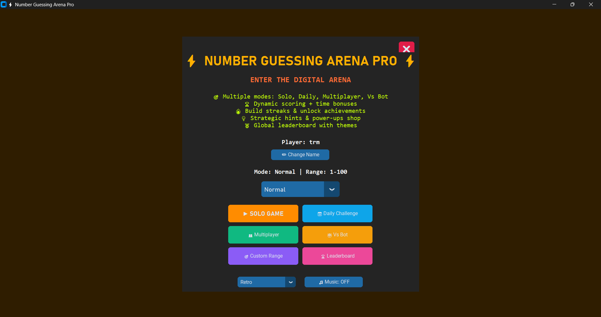
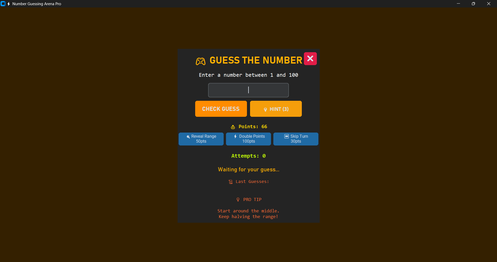
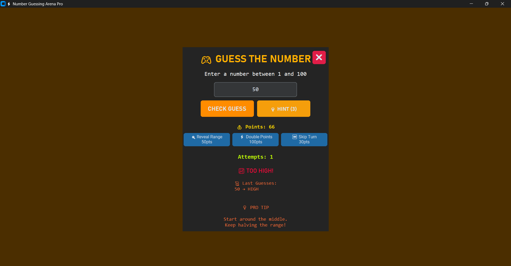
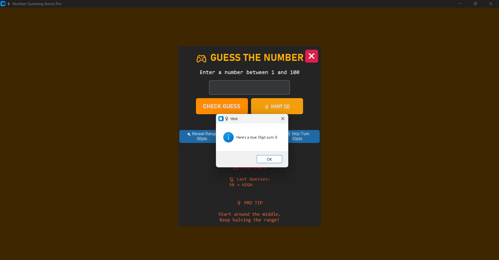
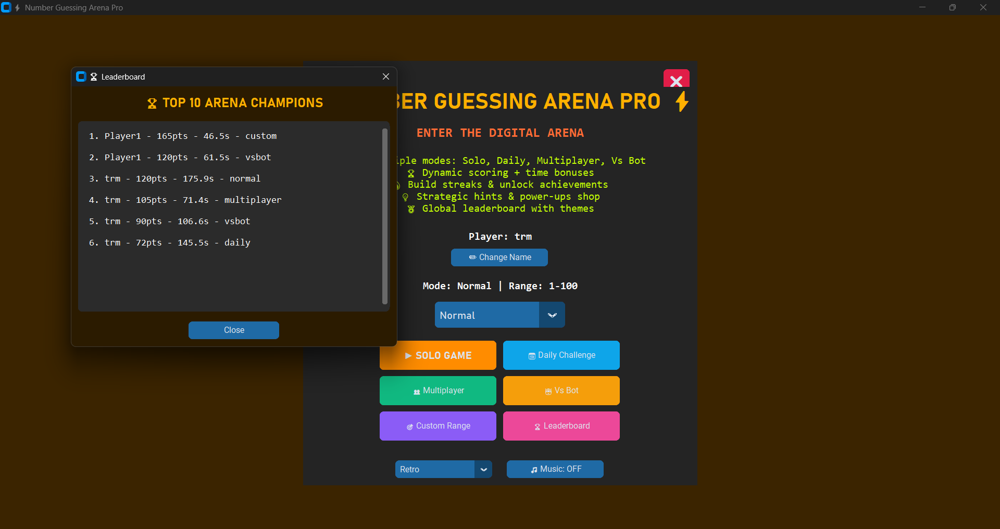
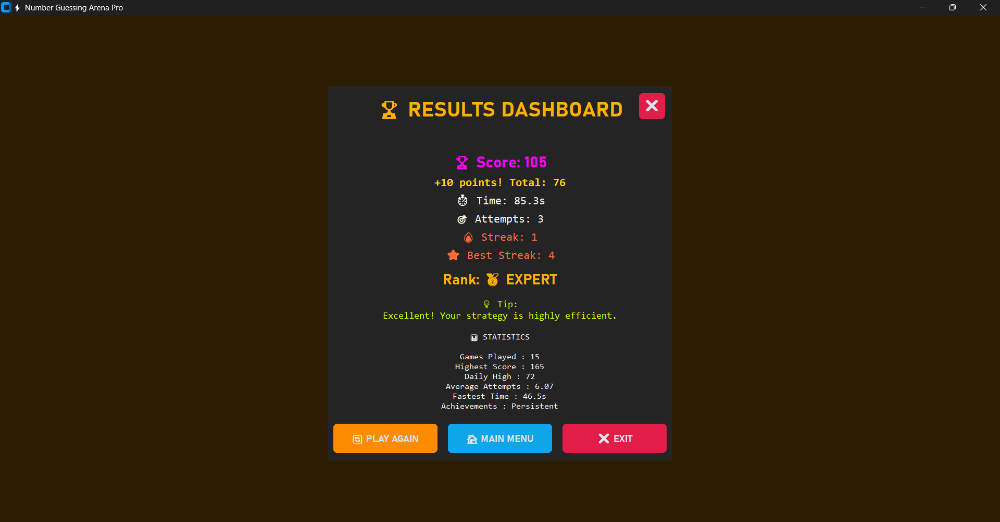

# ⚡ Number Guessing Arena Pro

> 🎮 A futuristic, feature-rich Number Guessing Game built with Python and CustomTkinter that transforms a classic guessing challenge into an immersive gaming experience with smart hints, achievements, rankings, leaderboards, custom difficulty ranges, and persistent statistics.

---

# 🚀 About The Project

**Number Guessing Arena Pro** is an advanced implementation of the classic Number Guessing Game developed as part of the **Software Development Internship Program at SkillCraft Technology**.

The game generates a random number and challenges players to identify it using logical reasoning and strategy. While fulfilling the original internship task requirements, this project significantly enhances the experience with a futuristic user interface, smart hints, achievements, global leaderboards, multiple game modes, custom ranges, player progression systems, and persistent statistics.

Unlike traditional number guessing games, **Number Guessing Arena Pro** introduces a complete gaming ecosystem featuring:

- 🎮 Multiple Game Modes
- 🌎 Global Leaderboard
- 🎛️ Custom Range Selection
- 💡 Smart Hint System
- 🏆 Achievement Unlocks
- 🔥 Streak Tracking
- 📊 Statistics Dashboard
- 👤 Player Profiles
- 🎨 Theme Customization
- 💾 Persistent Progress Saving

---

# 📋 Original Internship Task

### SkillCraft Technology – Software Development Task 02

Build a program that:

- Generates a random number.
- Prompts the user to enter a guess.
- Compares the guess with the generated number.
- Provides feedback if the guess is too high or too low.
- Continues until the correct number is guessed.

---

# ✨ Features

## 🎯 Core Gameplay

✅ Random Number Generation

✅ User Guess Validation

✅ High / Low Feedback

✅ Correct Guess Detection

✅ Interactive Gameplay

✅ Unlimited Attempts

---

## 🎨 Futuristic Gaming Interface

- Modern Cyberpunk-inspired Design
- Vibrant Neon Color Palette
- CustomTkinter GUI Framework
- Interactive Buttons & Controls
- Smooth Multi-Screen Navigation
- User-Friendly Experience

---

## 🎮 Multiple Game Modes

### ▶ Solo Mode
Classic number guessing experience.

### 📅 Daily Challenge
A special challenge mode with unique scoring opportunities.

### 👥 Multiplayer Mode
Compete with friends and compare performances.

### 🤖 VS Bot Mode
Challenge an AI opponent and test your strategy.

### 🎛️ Custom Range Mode
Create personalized challenges by selecting your own number range.

Examples:

- 1 – 100
- 1 – 500
- 1 – 1000
- User-defined custom ranges

Benefits:

- Adjustable difficulty
- Enhanced replayability
- Greater challenge variety

---

## 🌎 Global Leaderboard

Compete with other players and climb the rankings.

Features:

- Global Ranking Display
- High Score Tracking
- Competitive Gameplay
- Performance Comparison
- Top Player Showcase

---

## 💡 Smart Hint System

Players can enable hints during gameplay for strategic guidance.

Features:

- Dynamic Hint Generation
- Range-Based Suggestions
- Progressive Difficulty
- Smart Guess Assistance

Example:

```text
Secret Number = 12
Player Guess = 10

Hint:
💡 Hint Range: 7 - 17
```

---

## 🏆 Dynamic Scoring System

Players earn points based on efficiency and performance.

| Attempts | Score |
|-----------|--------|
| 1 – 3 | 100 |
| 4 – 5 | 80 |
| 6 – 8 | 60 |
| 9 – 12 | 40 |
| 13+ | 20 |

---

## 🔥 Streak Tracking System

Track consecutive victories and challenge yourself to beat your personal records.

Features:

- Current Win Streak
- Best Win Streak
- Persistent Streak Records
- Performance Tracking

---

## 🏅 Rank Progression System

Players earn ranks based on gameplay performance.

### Available Ranks

🥇 Master Guesser

🥈 Expert

🥉 Intermediate

🎯 Beginner

---

## 🏆 Achievement System

Unlock achievements through consistent gameplay and improved performance.

Examples:

- First Victory
- Fast Guesser
- Persistent Player
- Streak Master
- Daily Champion

---

## 👤 Player Profile System

Features:

- Custom Player Names
- Personalized Statistics
- Performance Tracking
- Progress Monitoring

---

## 📊 Statistics Dashboard

Monitor your growth through detailed analytics.

Statistics include:

- Games Played
- Highest Score
- Daily High Score
- Fastest Completion Time
- Average Attempts
- Achievement Progress
- Best Streak

---

## 🎨 Theme Customization

Personalize your gaming experience through theme selection.

Example:

- Retro Theme

Future-ready for additional themes.

---

## 💾 Persistent Data Storage

All player progress is automatically saved using JSON.

### Stored Information

- Games Played
- Highest Score
- Best Streak
- Average Attempts
- Achievements
- Player Records
- Statistics

Data remains available even after closing the application.

---

## ⚠️ Exit Confirmation

To prevent accidental exits, the application displays a confirmation dialog before closing.

---

# 🛠️ Technologies Used

| Technology | Purpose |
|------------|----------|
| Python | Core Programming Language |
| CustomTkinter | Modern GUI Development |
| JSON | Persistent Data Storage |
| Random Module | Number Generation |
| Tkinter Messagebox | Dialogs & Alerts |

---

# 📂 Project Structure

```text
SCT_SD_2/
│
├── start.py
├── stats.json
│
├── screenshots/
│   ├── home.png
│   ├── first.png
│   ├── guess1.png
│   ├── hint.png
│   ├── leader.png
│   └── score.png
│
└── README.md
```

---

# 📸 Project Screenshots

## 🏠 Home Screen



---

## 🎮 Game Start Screen



---

## 🎯 Guessing Interface



---

## 💡 Smart Hint System



---

## 🌎 Global Leaderboard



---

## 📊 Results Dashboard



---

# 🚀 Installation

### Clone the Repository

```bash
git clone https://github.com/your-username/SCT_SD_2.git
```

### Navigate to Project Directory

```bash
cd SCT_SD_2
```

### Install Dependencies

```bash
pip install customtkinter
```

### Run the Application

```bash
python start.py
```

---

# 🎮 How to Play

1. Launch the application.
2. Enter your player name.
3. Choose a game mode.
4. Select a range or challenge mode.
5. Click **Start Game**.
6. Guess the secret number.
7. Use hints strategically if needed.
8. Earn points based on performance.
9. Unlock achievements.
10. Improve your rank.
11. Compete on the leaderboard.
12. Track your progress through statistics.

---

# 🎓 Skills Demonstrated

This project showcases practical experience in:

- Python Programming
- GUI Development
- Event-Driven Programming
- Data Persistence
- JSON File Handling
- User Experience Design
- Problem Solving
- Application State Management
- Software Development Workflow

---

# 🌟 Key Highlights

✅ Futuristic Gaming Interface

✅ Smart Hint Engine

✅ Global Leaderboard System

✅ Custom Range Selection

✅ Multiple Gameplay Modes

✅ Achievement Unlock System

✅ Dynamic Scoring & Ranking

✅ Player Profile Management

✅ Statistics Dashboard

✅ Persistent Data Storage

✅ Theme Customization

✅ Enhanced Beyond Internship Requirements

---

# 🏆 Project Outcome

This project successfully fulfills the original internship requirements while expanding the concept into a complete gaming application. It demonstrates the ability to enhance a simple problem statement into a feature-rich software product through creativity, problem-solving, and modern GUI development techniques.

---

# 👨‍💻 Author

**Sarudharshini B**

Software Development Intern

**SkillCraft Technology**

---

# 📜 License

This project is created for educational, learning, and internship purposes.

---

## ⭐ If you found this project interesting, consider giving it a star on GitHub!
